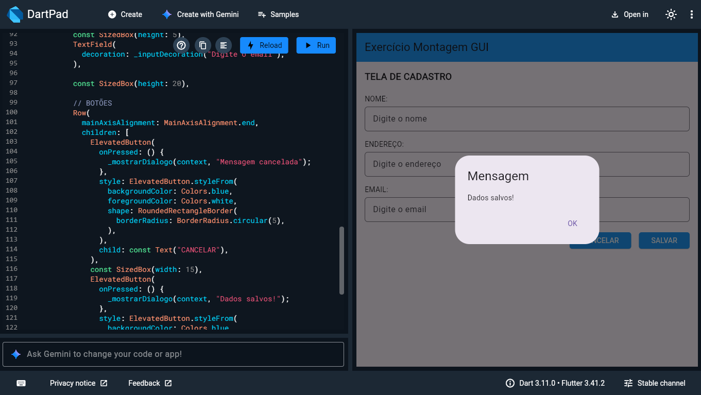

# Exercício - Montagem de GUI em Flutter

## Descrição

Este projeto foi desenvolvido com o objetivo de praticar a construção de interfaces gráficas (GUI) utilizando Flutter.

A aplicação consiste em uma tela de cadastro simples, contendo campos de entrada e botões, sem implementação de lógica de negócio, 
conforme solicitado na atividade, contendo as caizas de dialogo ao clicar nos botões.

---

## Objetivo

- Praticar o uso de widgets no Flutter
- Organizar elementos na tela
- Trabalhar com inputs e botões
- Exibir mensagens utilizando AlertDialog

---

## Funcionalidades

- Tela de cadastro com:
  - Campo Nome
  - Campo Endereço
  - Campo Email
- Botão **Salvar**
- Botão **Cancelar**
- Exibição de mensagem ao clicar nos botões

---

## Widgets Utilizados

- Scaffold
- AppBar
- Column
- Row
- Text
- TextField
- InputDecoration
- SizedBox
- ElevatedButton
- AlertDialog

---

## Tecnologias

- Flutter
- Dart
- Android Studio

---

## Como executar

abra este link em seu navegador e copie o codigo que esta neste repositorio "montagem_gui" e click em RUN

https://dartpad.dev/
